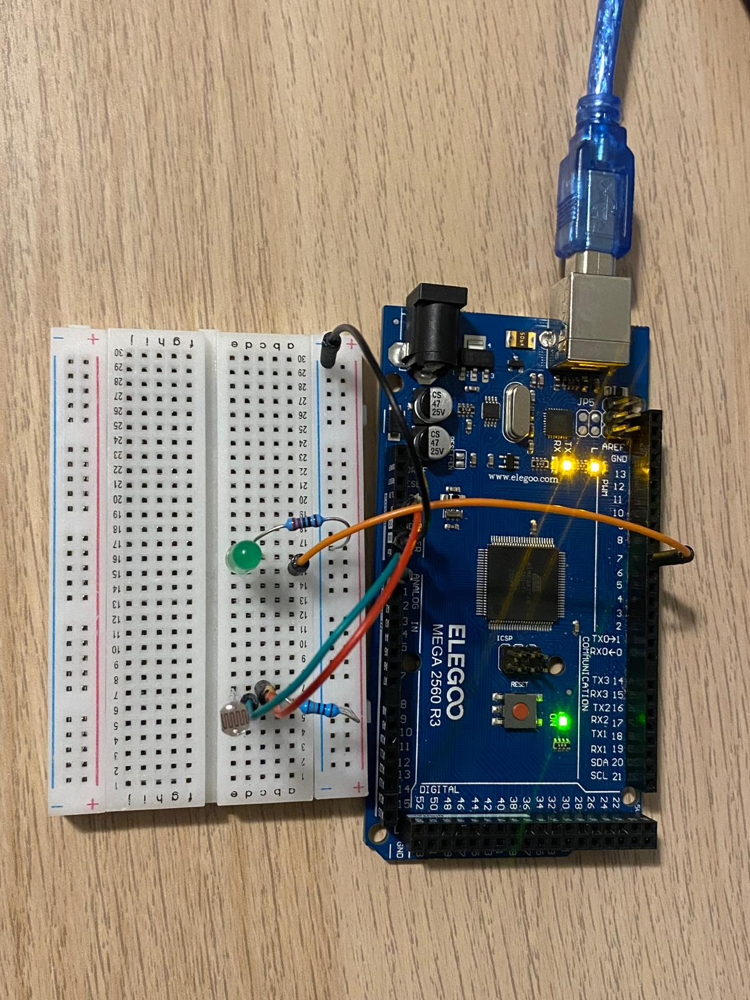

## Content 

This project demonstrates the usage of LDR (Light Dependent Resistor) sensor, Photoresistor. In this project, a white LED is connected to the Arduino's digital output pin, and a basic program that get the resistor value of the LDR is used to light on the LED.

## [Live Demo](./assets/light-night.mp4)

## How it works
1. **Circuit Setup**: the LED and the LDR are connected to a digital pin on the Arduino through a resistor to limit the current. 
2. **Programming**: The Arduino is programmed to turn the LED on when the detected value of the LDR is less than 500. It turns off otherwise.

## Components
- 1x Arduino Mega2560 
- 1x Breadboard
- 2x 220 Ohm Resistors
- 1x LED
- Wires

## Set up

## Wiring Diagram

////

## Circuit Schematic

////

## References
- [Arduino-Night-Light](https://www.instructables.com/Arduino-Night-Light)
